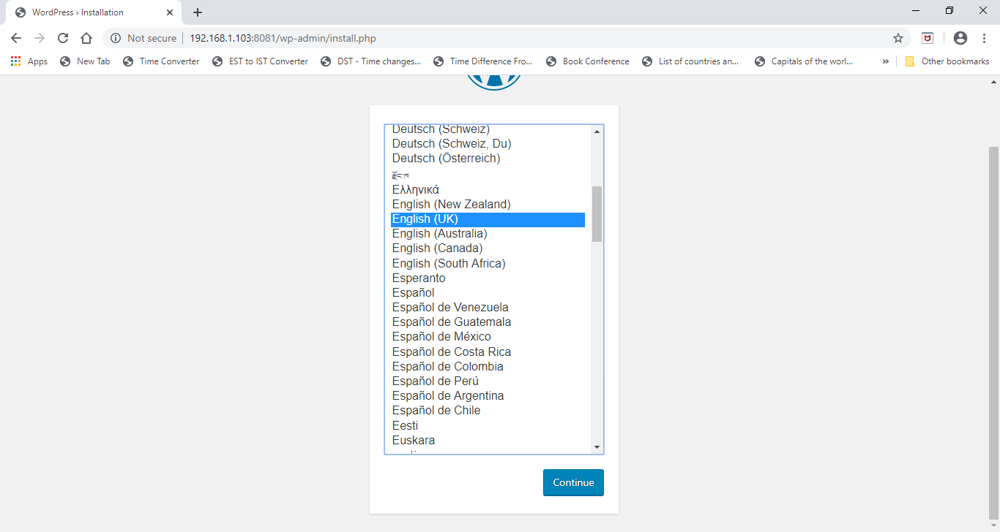
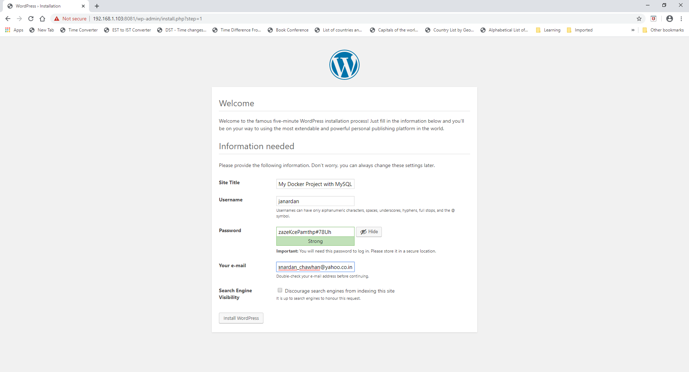
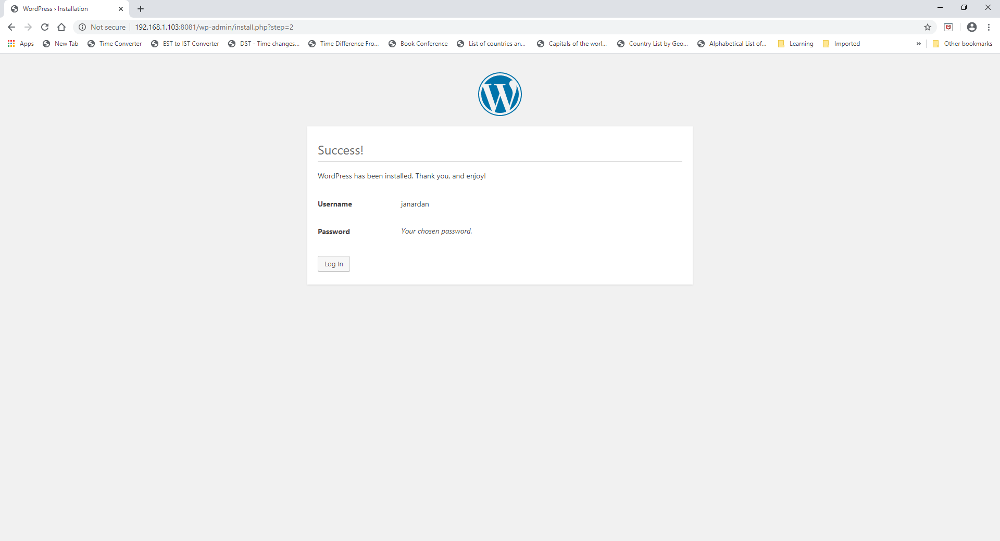
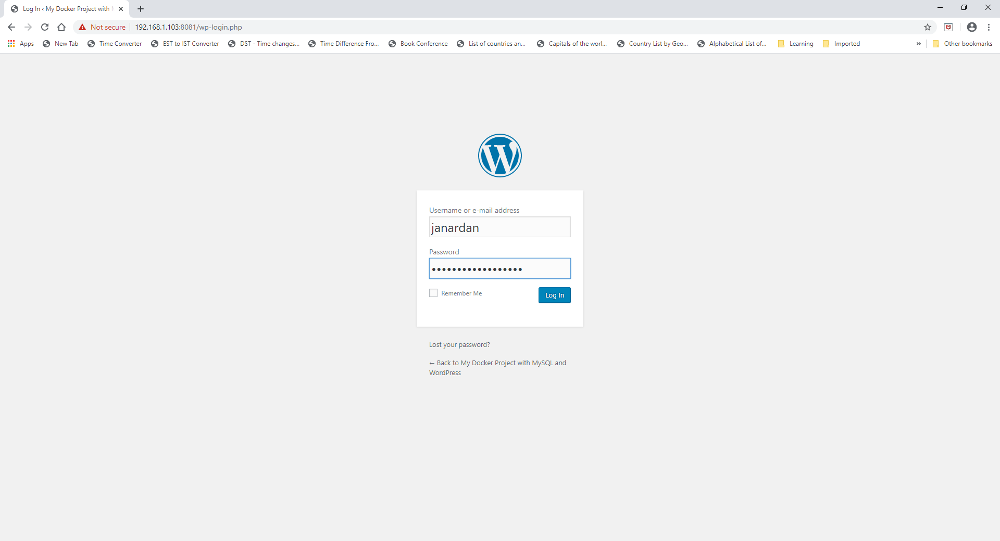
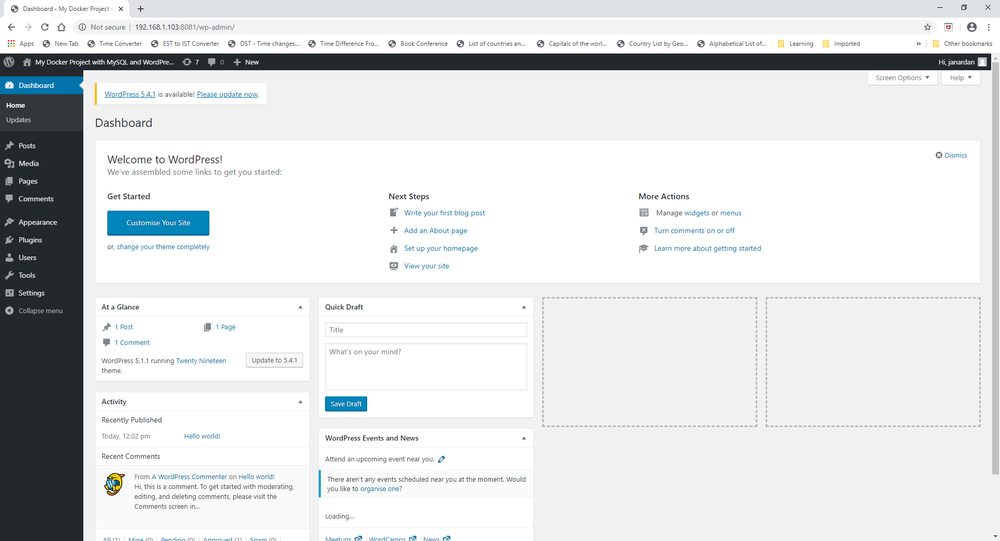
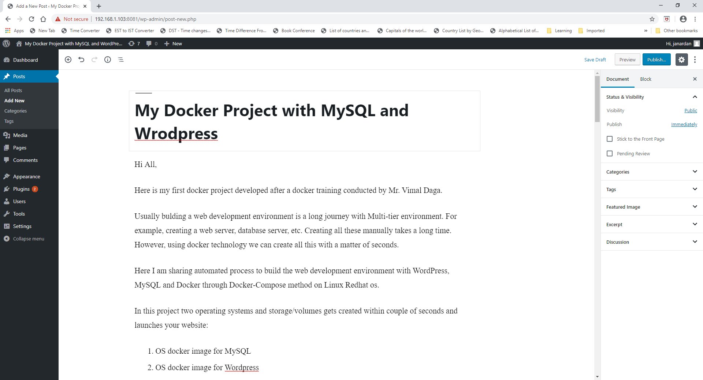

# Docker project with MySQL and WordPress

Hi All,

Here is my first docker project developed after a docker training conducted by Mr. Vimal Daga.

Usually bulding a web development environment is a long journey with Multi-tier environment. For example, creating a web server, database server, etc. Creating all these manually takes a long time. However, using docker technology we can create all this with a matter of seconds.

Here I am sharing automated process to build the web development environment with WordPress, MySQL and Docker through Docker-Compose method on Linux Redhat os.

In this project two operating systems and storage/volumes gets created within couple of seconds and launches your website:

1. OS docker image for MySQL
2. OS docker image for Wordpress
3. Storage or volume for MySQL
4. Storage or volume for Wordpres

<br/>

### Installing Docker community edition:
```
# dnf install docker-ce --nobest 
```
### Starting Docker service:
```
# systemctl start docker
```
### Installing Docker-Compose:
```
# curl -L "https://github.com/docker/compose/releases/download/1.25.5/docker-compose-$(uname -s)-$(uname -m)" -o /usr/local/bin/docker-compose

# chmod +x /usr/local/bin/docker-compose
```
### Download Wordpress and mysql images from hub.docker.com
```
# docker pull wordpress:5.1.1-php7.3-apache
# docker pull mysql:5.7
```
### Create volumes
```
# docker volume create mysql_storage_new
# docker volume create wp_storage_new
```
### Create a new directory for our workplace, for example, mycompose:
```
# mkdir mycompose
```
### Inside mycompose directory, create yml file named as 'docker-compose.yml'.
```
# vim docker-compose.yml
```
<br/>
Write the below contents in the docker-compose.yml file:

```
version: '3'

services:
    dbos:		# Note that this is your database host name
        image: mysql:5.7
        volumes:
            - mysql_storage_new:/var/lib/mysql
        restart: always
        environment:
            MYSQL_ROOT_PASSWORD: <<your root user password>>
            MYSQL_USER: <<your user name>>
            MYSQL_PASSWORD: <<your database password>>
            MYSQL_DATABASE: <<your database name>>

    wordpressos:
        image: wordpress:5.1.1-php7.3-apache
        restart: always
        depends_on:
             - <<your database host name>>
        ports:
             - 8081:80
        environment:
            WORDPRESS_DB_HOST: <<your database host name>>
            WORDPRESS_DB_USER: <<your database user  name>>
            WORDPRESS_DB_PASSWORD: <<your database password>>
            WORDPRESS_DB_NAME: <<your database name>>
        volumes:
            - wp_storage_new:/var/www/html

volumes:
    mysql_storage_new:
    wp_storeage_new:
```

### Start the docker-compose
```
# docker-compose up
```
This will start the MySQL and Wordpres services.

a. Take the ip address of your Redhat machine and go to your local machine, for me it's Windows machine and enter the following address in the internet browser: <br/>
```
http://<<your redhat ip address>>:8081
```
First time, this will open Wordpress to create your account. This is one time activity.


1. Select the  language<br/><br/>
<br/><br/>
2. Enter new account details and password<br/><br/>
<br/><br/>
3. Login with your new credentials<br/><br/>
<br/><br/>
4. Once account is created it will take you to the Wordpress Dashboard page from where you can create your own Blog or any new website.<br/><br/>
<br/><br/>
5. Click “Write your first blog post” button to create your first web page.<br/><br/>
<br/><br/>
6. Enter Header and blog contents.<br/><br/>
<br/><br/>

Next time whenever you will open the following link it will load your blog.
```
http://<<your redhat ip address>>:8081
```
### Stop the docker-compose
```
# docker-compose stop
```
Also if you want to remove MySQL and Wordpress docker images and network defaults, you can enter follwing command:
```
# docker-compose down
```
Note that there will be no change in the data as we have stored it in the  external volumes.
